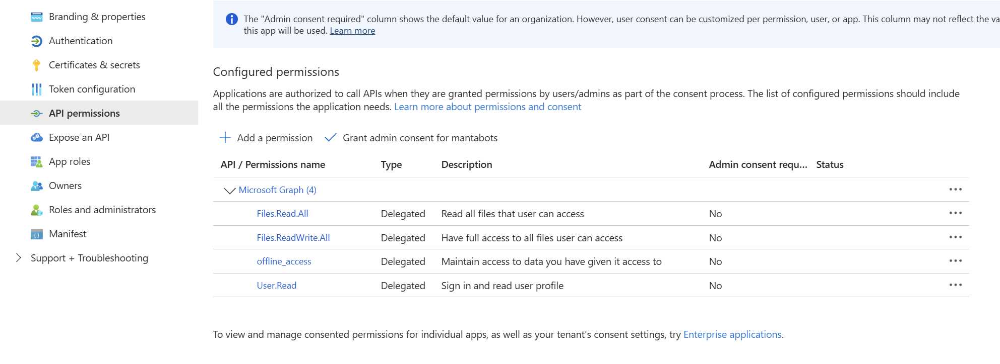

===================
invoices-management
===================

About The Project
=================

This project automates part of the invoices automatic processing by sharing a list of invoices file and retrieving their url.
The rest of the process can be perforned through chatgpt

.. image:: https://badgen.net/github/checks/MantaBots27318/invoices-management
   :target: https://github.com/MantaBots27318/invoices-management/actions/workflows/release.yml
   :alt: Status
.. image:: https://badgen.net/github/commits/MantaBots27318/invoices-management/main
   :target: https://github.com/MantaBots27318/invoices-management
   :alt: Commits
.. image:: https://badgen.net/github/last-commit/MantaBots27318/invoices-management/main
   :target: https://github.com/MantaBots27318/invoices-management
   :alt: Last commit

Built And Packaged With
-----------------------

.. image:: https://img.shields.io/static/v1?label=python&message=3.12.6rc1&color=informational
   :target: https://www.python.org/
   :alt: Python

Principle
=========

We use ChatGPT to automatically update our expenses list from a set of invoices file provided to it through uploading.
What ChatGPT can't do, since it's not an agent, is upload the invoices to the organization google drive, share them to everybody with a link, 
and retrieve the associated url.

This python scripts performs the following steps :

1) List the files in a OneDrive tree 
2) Update them to be shared with everybody with the link
3) Create an excel sheet associating the filename with its link

With that data, ChatGPT is able to update the organization expense tracker sheet "invoices" column by adding hyperlink to the retrieved URL

NB : Invoices files shall have been previously manually uploaded to drive

Getting Started
===============

Prerequisites
-------------

An Azure subscription shall have been created for the personal account owning the contact list

Configuration
-------------

Secrets
-------

Creating The Azure app
**********************

1. Go to Microsoft Entra ID > Manage > App registrations
2. Create a new App registration and choose its name
3. Choose to support **Accounts in any organizational directory (Any Microsoft Entra ID tenant - Multitenant) and personal Microsoft accounts (e.g. Skype, Xbox)**. This is key to make sure that your app will gain access to the user personal account which is located in another Azure tenant and it can not be change afterwards
4. Set the redirect URI to https://mantabots.org
5. Create the app

Configuring the app
*******************

1. Go to Authentication. Add a new web platform and choose to implicit grant shall be set to Access tokens and ID tokens

.. image:: doc/azure-app-authentication.png

2. Go to Api permissions and grant the following API permissions :
   * offline_access enables to maintain the acquired authorization the app has for the Microsoft personal account
   * Files.ReadWriteAll enables to list invoices files and update their sharing attributes

3. Go to Certificates and secrets and create a secret. Store it in a safe place:

Retrieving API access token
***************************

The token can be gathered the following way :

- In a web browser, enter address :
.. code-block:: bash

   https://login.microsoftonline.com/common/oauth2/v2.0/authorize?client_id=<MY APPLICATION ID>&response_type=code&redirect_uri=https://mantabots.org&response_mode=query&scope=offline_access%Files.ReadWrite%20User.Read

- Select the user owning the drive for authentication
- You'll be redirected to

.. code-block:: bash
   https://mantabots.org/?code=<AUTHORIZATION CODE>

- In the command line, use curl :

.. code-block:: bash

   curl -X POST https://login.microsoftonline.com/common/oauth2/v2.0/token \
     -H "Content-Type: application/x-www-form-urlencoded" \
     -d "client_id=<MY_APPLICATION_ID>" \
     -d "scope=offline_access Files.ReadWrite User.Read" \
     -d "code=<AUTHORIZATION CODE>" \
     -d "redirect_uri=https://mantabots.org" \
     -d "grant_type=authorization_code" \
     -d "client_secret=<MY_CLIENT_SECRET>"

The result will contain a short term token and a long term token to update the token.json file. Save the token

Usage
=====

In an environmentin which python, pip and bash has been installed :

.. code-block:: bash

   ./scripts/process.sh -k <MY_TOKEN> -p <MY ONEDRIVE TREE ROOT FOLDER> -o <RESULTING EXCEL SHEET NAME>

In an environemnt in which docker is available :

.. code-block:: bash

   ./scripts/launch.sh -k <MY_TOKEN> -p <MY ONEDRIVE TREE ROOT FOLDER> -o <RESULTING EXCEL SHEET NAME>

Note that in this last case, the excel sheet shall be produced in a directory mounted in docker. By default, only the repository path is mounted as home. 
If you want the file to be produced elsewhere, modify the scripts accordingly to mount the output path in the docker container

Issues
======

.. image:: https://img.shields.io/github/issues/MantaBots27318/invoices-management.svg
   :target: https://github.com/MantaBots27318/invoices-management/issues
   :alt: Open issues
.. image:: https://img.shields.io/github/issues-closed/MantaBots27318/invoices-management.svg
   :target: https://github.com/MantaBots27318/invoices-management/issues
   :alt: Closed issues

Roadmap
=======

Contributing
============

.. image:: https://contrib.rocks/image?repo=MantaBots27318/invoices-management
   :alt: GitHub Contributors Image

Contact
=======

MantaBots - coaches@mantabots.org